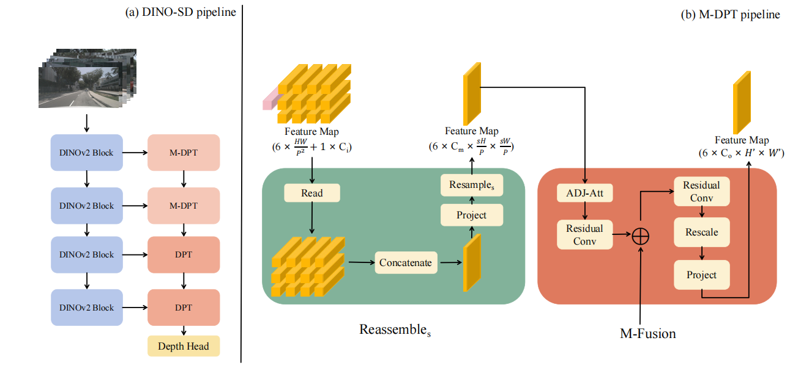

# DINO-SD
### [Paper](https://arxiv.org/abs/2405.17102) | [Data]() | [中文解读]()
<br/>

> DINO-SD: Champion Solution for ICRA 2024 RoboDepth Challenge

>[Yifan Mao*](), [Ming Li*](), [Jian Liu*](https://hitcslj.github.io/), [Jiayang Liu](), [Zihan Qin](), [Chunxi Chu](), [Jialei Xu](), [Wenbo Zhao](), [Junjun Jiang](), [Xianming Liu]() 

<p align='center'>

</p>


## Introduction
Surround-view depth estimation is a crucial task aims to acquire the depth maps of the surrounding views. It has many applications in real world scenarios such as autonomous driving, AR/VR and 3D reconstruction, etc. However, given that most of the data in the autonomous driving dataset is collected in daytime scenarios, this leads to poor depth model performance in the face of out-of-distribution(OoD) data. While some works try to improve the robustness of depth model under OoD data, these methods either require additional training data or lake generalizability. In this report, we introduce the DINO-SD, a novel surround-view depth estimation model. Our DINO-SD does not need additional data and has strong robustness. Our DINO-SD get the best performance in the track4 of ICRA 2024 RoboDepth Challenge.

## Model Zoo

| model     | dataset | Abs Rel ↓  | Sq Rel  ↓ | RMSE ↓  | RMSE Log  ↓ | a1 ↑ | a2 ↑ | a3 ↑ | download |  
|:-------:|:-------:|:-------:|:-------:|:-------:|:-------:|:-------:|:-------:|:-------:|:-------:|
| Baseline | nuScenes | 0.304 | 3.060 | 8.527 |  0.400 | 0.544 | 0.784 | 0.891 |  [model](https://cloud.tsinghua.edu.cn/f/72717fa447f749e38480/?dl=1) |
| DINO-SD | nuScenes | 0.187 | 1.468 | 6.236 | 0.276 | 0.734 | 0.895 | 0.953 | [model]() |

## Install
* python 3.8, pytorch 2.2.2, CUDA 11.7, RTX 3090
```bash
git clone https://github.com/hitcslj/DINO-SD.git
conda create -n dinosd python=3.8
conda activate dinosd
pip install -r requirements.txt
```

## Data Preparation
Datasets are assumed to be downloaded under `data/<dataset-name>`.

* Please download the official [nuScenes dataset](https://www.nuscenes.org/download) to `data/nuscenes/raw_data`
* Export depth maps for evaluation 
```bash
cd tools
python export_gt_depth_nusc.py val
```

For evaluation data preparation, kindly download the dataset from the following resources:

| Type | Phase 1 | Phase 2 |
| :-: | :-: | :-: |
| Google Drive | [`link1`](https://drive.google.com/file/d/1FEiBlX9SV69DEaHVfpKcWjkTZQAVSfvw/view?usp=drive_link) or [`link2`](https://drive.google.com/file/d/1V2YTaBgqEEKKFiD7uQ2z3cf7GMHuUYk1/view?usp=sharing) | [`link1`](https://drive.google.com/file/d/1wBg0RhjboUmBs6Ibyq-d8qNzZTgtalwV/view?usp=sharing) or `link2` |


* The final data structure should be:
```
DINO-SD
├── data
│   ├── nuscenes
│   │   ├── depth
│   │   └── raw_data
|   |       ├── maps
|   |       ├── robodrive-v1.0-test
|   |       └── samples 
│   └── robodrive
├── datasets
│   ├── __init__.py
│   ├── corruption_dataset.py
│   ├── ddad_dataset.py
│   ├── mono_dataset.py
│   ├── nusc_dataset.py
│   ├── nusc
│   ├── ddad
│   └── robodrive
│
...
```

## Training
```bash
bash train.sh # baseline
bash train_dinosd.sh # dino-sd
```

## Evaluation
```bash
bash eval.sh
bash eval_dinosd.sh # dino-sd
```

The generated results will be saved in the folder structure as follows. Each `results.pkl` is a dictionary, its key is `sample_idx` and its value is `np.ndarray`.

```bash
.
├── brightness
│   └── results.pkl
├── color_quant
│   └── results.pkl
├── contrast
│   └── results.pkl
...
├── snow
└── zoom_blur
```

Next, kindly merge all the `.pkl` files into a **single** `pred.npz` file.

You can merge the results using the following command:
```bash
python ./convert_submit.py
```
> **:warning: Note:** The prediction file **MUST** be named as `pred.npz`.

Finally, upload the compressed file to Track `4`'s [evaluation server](https://codalab.lisn.upsaclay.fr/competitions/17226) for model evaluation.

> **:blue_car: Hint:** We provided the baseline submission file at [this](https://drive.google.com/drive/folders/1oEDgaBdmkXN3dv45fbvnzdo9Gw20PXk-?usp=sharing) Google Drive link. Feel free to download and check it for reference and learn how to correctly submit the prediction files to the server.

## Acknowledgement

Our code is based on [SurroundDepth](https://github.com/weiyithu/SurroundDepth).

## Citation

If you find this project useful in your research, please consider cite:
```
@article{mao2024dino,
  title={DINO-SD: Champion Solution for ICRA 2024 RoboDepth Challenge},
  author={Mao, Yifan and Li, Ming and Liu, Jian and Liu, Jiayang and Qin, Zihan and Chu, Chunxi and Xu, Jialei and Zhao, Wenbo and Jiang, Junjun and Liu, Xianming},
  journal={arXiv preprint arXiv:2405.17102},
  year={2024}
}
```